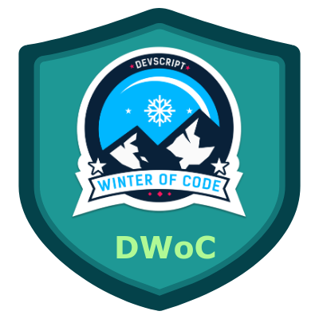

# MEDVICE :heart_decoration:

It is a Web Application to offer some advice by taking in the symptoms and telling probablity of a disease.

## About the Project :thought_balloon:

Our aim is to develop a website that asks for symptoms and predict the possible health issues. It mainly focuses on Mental Health related problems. However, initially we will work with datasets of different diseases for which opensource datasets are available.

## Programs We have been associated with 🤍

## Contributing :point_down:

Contributions are what make the open source community such an amazing place to be learn, inspire, and create. Any contributions you make are **highly appreciated**.

1. Fork the Project
2. Create your Feature Branch (`git checkout -b feature/AmazingFeature`)
3. Commit your Changes (`git commit -m 'Add some AmazingFeature'`)
4. Push to the Branch (`git push origin feature/AmazingFeature`)
5. Open a Pull Request

## Roadmap :world_map:

1. Collecting Datasets of Different Diseases. 

2. Trying different Machine Leasning Algorithms on the Datasets.

3. Comparing their performance.

4. Deploying using Flask

See the [open issues](https://github.com/shatakshisingh24/Medvice/issues) for a list of proposed features (and known issues).

<--! CONTRIBUTER'S SECTION-->

## ❤️ Thanks to our awesome contributors:technologist: ✨✨
<table>
  <tr>
    <td align="center">
            <a href="https://github.com/shatakshisingh24">
               
              <b>shatakshisingh24</b>
            </a> 
            <a href="https://github.com/Jayshah6699/datascience-mashup/commits?author=shatakshisingh24">   
                👑 👀 💬 Author
            </a>
          </td>
    <td align="center">
            <a href="https://github.com/Novartus">
               
              <b>Novartus</b>
            </a> 
            <a href="https://github.com/Jayshah6699/datascience-mashup/commits?author=Novartus">
                💻
            </a>
          </td>
    <td align="center">
            <a href="https://github.com/samir-0711">
               
              <b>samir-0711</b>
            </a> 
            <a href="https://github.com/Jayshah6699/datascience-mashup/commits?author=samir-0711">
                📖
            </a>
          </td>
  </tr>
</table>

